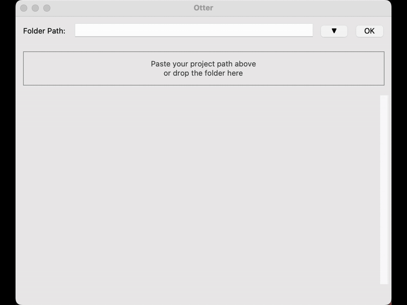
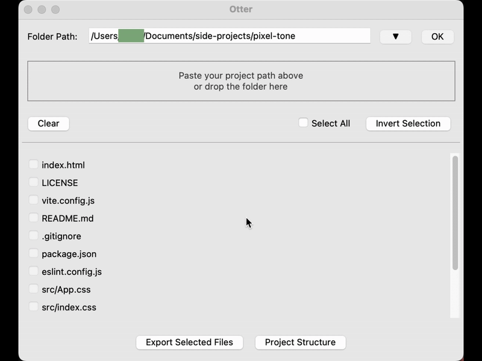
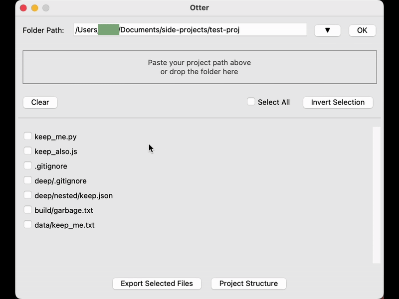
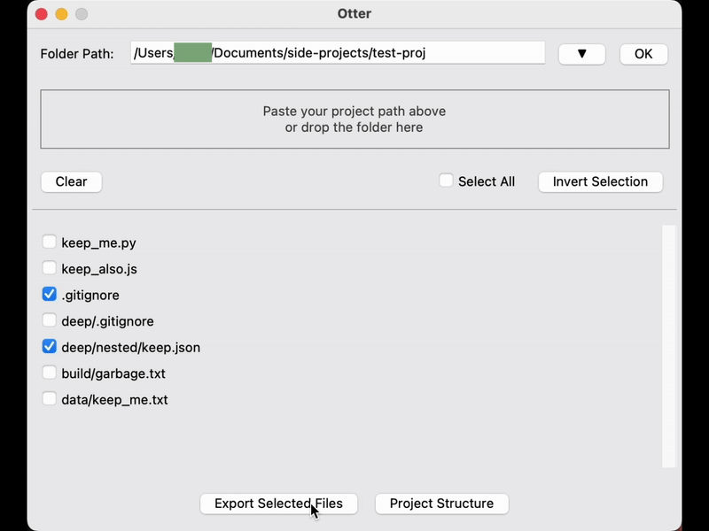

<h1 align="center">Otter</h1>

<div align="center">
  <p align="center"><i>Gather your project files in one sweep like an otter neatly collecting what it finds.</i></p>

  <p align="center">
    
    
    
    
  </p>
</div>

<div align="center">
  <a href="https://www.pexels.com/video/an-otter-swimming-2554576/">
    
  </a>
</div>

<br>

<div align="center">
  <p>Otter is a lightweight Python tool that quickly exports project files into a single text file, including each file’s path and content.</p>
  <p>Paste your project folder path, scan the files, select what you need, and export. Empty or unreadable files are automatically marked.</p>
</div>

## Current Features

- **Simple Graphical Interface:** A lightweight Tkinter-based interface with drag-and-drop folder input, navigation buttons, and a clear button to reset the current project.
- **Folder Scanning and Filtering:** Automatically scans a selected folder, applies built-in ignore rules, and also reads `.gitignore` to skip irrelevant files such as caches, configs, images, logs, binaries, and other noise.
- **Flexible File Selection:** Choose files using checkboxes with quick actions like select all, deselect all, or invert selection.
- **Project Structure View:** A dedicated structure page provides a tree-style visualization of the project and supports one-click copy-to-clipboard.
- **File Exporting:** Export selected files into a single consolidated text file (`project_export.txt`) stored in the Downloads folder, including each file’s path and its content.
- **Empty File Handling:** Detects unreadable or empty files and marks them with clear placeholders such as "[Empty file]" or "[Could not read file]".
- **Pop-up Notifications:** Provides concise pop-ups for invalid paths, empty results, completed exports, and other key interactions.
- **Recent Path History:** Automatically stores up to the five most recently used folder paths for quick access in future sessions.

## Demo

<div align="center">
  
</div>
<p align="center">Drag-and-Drop Folder Input</p>

<div align="center">
  
</div>
<p align="center">Recent Path History</p>

<div align="center">
  
</div>
<p align="center">Select All / Deselect All / Invert Selection</p>

<div align="center">
  
</div>
<p align="center">Project Structure Tree & One-Click Copy</p>

## Getting Started

You can download the latest prebuilt macOS and Windows applications from the [Releases](https://github.com/lu7ue/otter/releases) page.  
Alternatively, you can run Otter from source using the instructions below.

**Installation：**

Clone this repository and navigate to the project folder, then run:

```python
python -m venv venv          # Create a virtual environment
source venv/bin/activate     # Activate the environment on MacOS
python main.py               # Run the tool
```

Tip: 
1. If creating a virtual environment fails, you may not have Python installed on your system. Please install Python first, then try again.
2. If you are using Windows, the command for activating the enviornment may differ slightly. For example, you can run `.\venv\Scripts\Activate.ps1`. Please activate your environment using the appropriate command for your system.
3. If running `python main.py` results in an import error for `tkinterdnd2`, install it with: `pip install tkinterdnd2`.

<br>

> If you prefer to build the standalone macOS or Windows application yourself, see the [BUILD INSTRUCTIONS](BUILD_INSTRUCTIONS.md) for instructions.


## Storage of Recent Folder History
The application stores the history of opened folders in a JSON file named `Otter_history.json`. The file is automatically created and updated by the app.

**File locations by operating system:**
- Windows: `C:\Users\<username>\AppData\Roaming\Otter_history.json`
- macOS: `/Users/<username>/Library/Application Support/Otter_history.json`
- Linux: `/home/<username>/.local/share/Otter_history.json`

Replace `<username>` with your actual system username.

## Credits
Video by Magda Ehlers: https://www.pexels.com/video/an-otter-swimming-2554576/